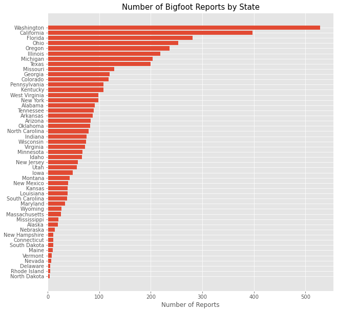
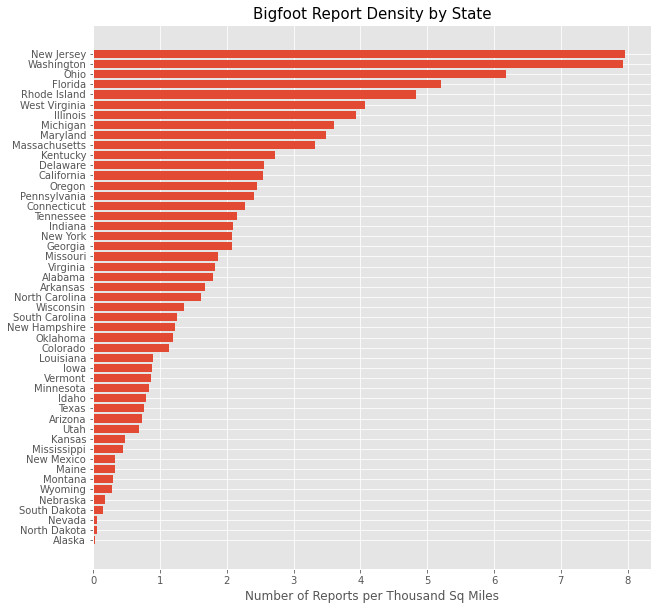
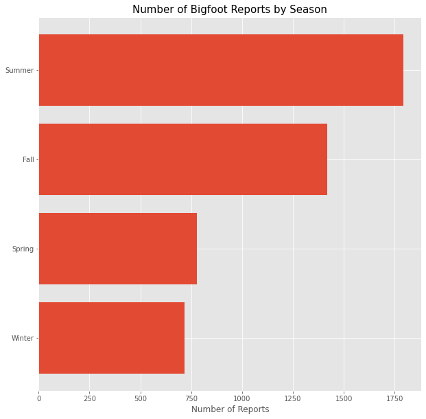
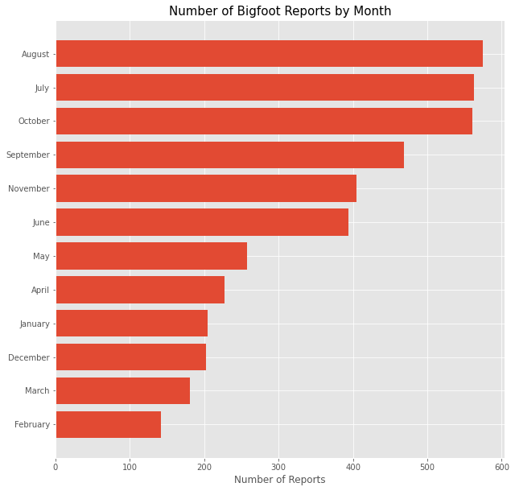
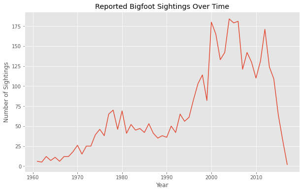

# How to Find Bigfoot
## Isabella Sun and Josh Bernd

## Introduction 
Admiral Iron-Stump from the Edwards AirForce Base contracted us to analyze reports on Bigfoot sightings to help in the search for Bigfoot a.k.a. 'Sasquatch'. 

## The Data
The data consists of 4,857 web-scraped entries scraped from the Geographic Database of Bigfoot/Sasquatch Sightings and Reportings. The good people that run this organization have meticulously documented all aspects of each reported sighting.

## Exploratory Data Analysis
First we examine the reports to identify where and when there have been Bigfoot Sightings. In terms of number of reports, Washington and California lead the pack in terms of most bigfoot sightings.  

We also examined the density of bigfoot sightings by state since some states by square miles, are much larger than others. The states with the most bigfoot sightings per thousand square miles is New Jersey. Washington, despite being a medium sized state by land, remains at the top of the list for Bigfoot Sightings. 

Summer and fall are the seasons when there are the most bigfoot sightings. 

Looking specifically at the months reported, late summer and early fall are the times when there are the most bigfoot sightings. We speculate that this could be Bigfoot mating season. 

We also examine the number of Bigfoot reports over time. From the 1960s to the late 1990s, there has been a general increase in the number of Bigfoot sightings. There is a sharp increase in the number of sightings in the 2000s but a sharp drop in reported sightings since 2010. This decrease is cause for concern and we must consider the impact that continued deforestation and climate change has had on the Bigfoot population. 

## NLP Results

We used a Non-Negative Matrix Factorization model to analyze the text in the reports. 

The reports could be long winded and rambling, so we chose to use NMF in order to look for relationships lost in large amounts of ambiguous data. Also, bigfeet can sense negativity so NMF was the clear choice.

### Topic 1: Hunting in the Woods
- river
- back
- us
- tree
- could
- would
- like
- see
- deer
- trail
- one
- area
- got
- hunting

### Topic 2: Travel/Expeditions 
- stan
- courtney
- illinois
- animal
- presentations
- stancourtney
- blog
- travels
- collected
- audio
- giving
- special
- recording
- com

### Topic 3: Sounds at Night
-	heard
-	sound
-	lake
-	sounds
-	vocalizations
-	night
-	scream
-	loud
-	camp
-	tent
-	area
-	witness
-	sounded
-	hear

### Topic 4: Footprints
-	tracks
-	snow
-	prints
-	track
-	found
-	footprints
-	print
-	inches
-	foot
-	area
-	toes
-	trail
-	footprint
-	road

### Topic 5: Expeditions/Private Tours
-	florida
-	expedition
-	michigan
-	expeditions
-	north
-	private
-	iowa
-	central
-	swamp
-	georgia
-	organizer
-	cathy
-	woods
-	possible

### Topic 6: Cabin in the Woods (with a dog)
-	house
-	window
-	woods
-	dogs
-	outside
-	night
-	dog
-	door
-	home
-	back
-	property
-	heard
-	said
-	yard

### Topic 7: Driving
-	road
-	creature
-	sighting
-	saw
-	witness
-	car
-	driving
-	animal
-	hair
-	highway
-	tall
-	side
-	arms
-	area

### Topic 8: Canada
-	island
-	vancouver
-	mcmillan
-	cc
-	british
-	blaine
-	lake
-	bc
-	manitoba
-	canada
-	sasquatch
-	rocks
-	columbia
-	reg

## Our Definitive Bigfoot Encounter Checklist:
- Focus your search on Washington, Oregon, California. A trip up and down the west coast will hit three of the five states with most sightings.
- Bigfeet populations have flourished over the past 50 years, and most sightings happen during their mating season which is between July and October. Keep your ears peeled for loud howls and grunts.
- Keep your eyes on the ground:
- Always stick to wooded areas. Bigfeet are playfull creatures and love to hide in your peripherals and the jump behind trees before you get a good look at them!
- Ask around for any upcoming bigfoot expiditions, locals always know best!
- Keep your eyes peeled when your expedition loses focus, A lot of sightings happen when everyone else is looking the other way...
- If you're feeling brave, bring your tent and recording equipment - but don't fall asleep! A lot of sightings occur under the cover of darkness.
- No going to Hawaii! Bigfeet can't stand pineapple and shaved ice.
